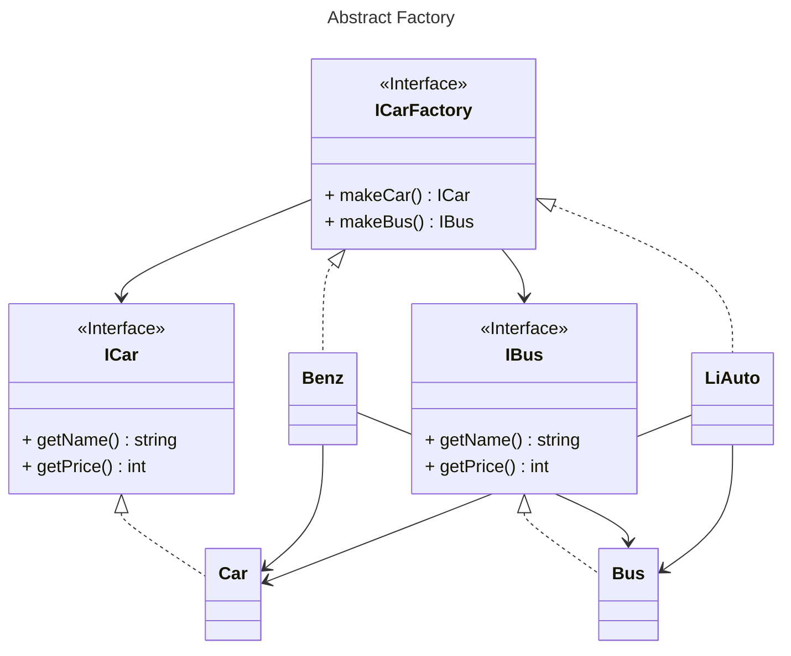

# Abstract Factory

```mermaid
---
title: Abstract Factory
---
classDiagram
class ICarFactory {
  <<Interface>>
	+ makeCar() ICar
	+ makeBus() IBus
}

class Benz
class LiAuto
ICarFactory <|.. Benz
ICarFactory <|.. LiAuto

class ICar {
  <<Interface>>
  + getName() string
	+ getPrice() int
}
ICarFactory --> ICar
class Car
ICar <|.. Car
Benz --> Car
LiAuto --> Car

class IBus {
  <<Interface>>
  + getName() string
	+ getPrice() int
}
ICarFactory --> IBus
class Bus
IBus <|.. Bus
Benz --> Bus
LiAuto --> Bus

```