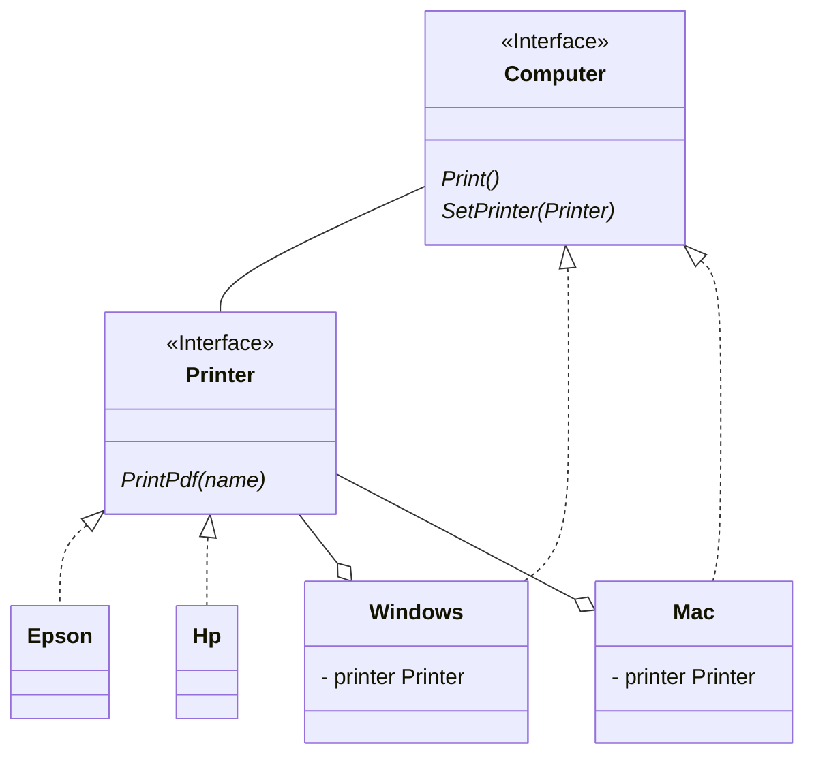

# Bridge

```mermaid
classDiagram
class Printer {
  <<Interface>>
  PrintPdf(name)*
}
Printer <|.. Epson
Printer <|.. Hp

class Computer {
  <<Interface>>
  Print()*
  SetPrinter(Printer)*
}
Computer -- Printer
class Windows {
 - printer Printer
}
class Mac {
 - printer Printer
}
Computer <|.. Windows
Computer <|.. Mac
Printer --o Windows
Printer --o Mac
```
