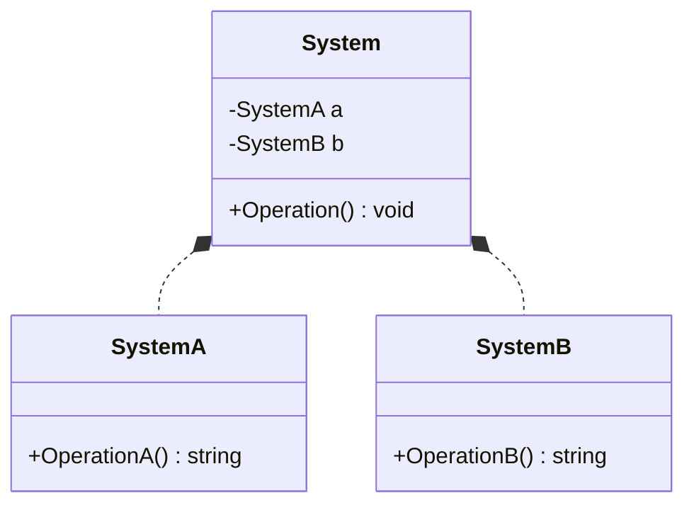

# Facade

[Facade.go](./Facade.go)

```mermaid
classDiagram
class SystemA {
  +OperationA() string
}

class SystemB {
  +OperationB() string
}

class System {
  +Operation() void
  -SystemA a
  -SystemB b
}

System *.. SystemA
System *.. SystemB
```
